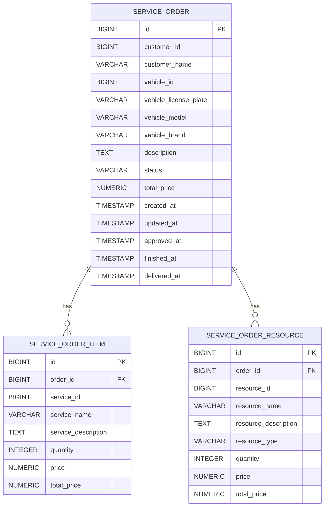

# OS Service Microservice

Microserviço para gerenciamento de Ordens de Serviço (OS) do sistema Car Garage.

## 📋 Sumário

- [Visão Geral](#-visão-geral)
- [Arquitetura](#-arquitetura)
- [Tecnologias](#-tecnologias)
- [Estrutura do Projeto](#-estrutura-do-projeto)
- [Modelo ER do Banco](#-modelo-er-do-banco)
- [Workflow de Status](#-workflow-de-status)
- [Saga Pattern](#-saga-pattern)
- [API Endpoints](#-api-endpoints)
- [Execução Local](#-execução-local)
- [Docker](#-docker)
- [Kubernetes](#-kubernetes)
- [Testes](#-testes)
- [CI/CD](#-cicd)
- [Documentação da API](#-documentação-da-api)

## 🎯 Visão Geral

O OS Service é um microserviço extraído do monolito Car Garage, responsável pelo gerenciamento completo do ciclo de vida das Ordens de Serviço. Implementa arquitetura limpa (Clean Architecture), comunicação assíncrona via **AWS SQS** para orquestração de Saga Pattern e está preparado para deploy em ambiente **AWS com EKS** e **RDS PostgreSQL**.

### Funcionalidades Principais

- ✅ Criação e gerenciamento de ordens de serviço
- ✅ Controle do fluxo de trabalho (workflow de status)
- ✅ Aprovação/rejeição de orçamentos pelo cliente
- ✅ Cálculo de tempo de execução
- ✅ Compensação de transações distribuídas (Saga Pattern)
- ✅ API RESTful documentada com OpenAPI/Swagger
- ✅ Métricas e health checks para observabilidade

## 🏗 Arquitetura

### Clean Architecture

O projeto segue os princípios da Arquitetura Limpa, separando responsabilidades em camadas:

```
┌─────────────────────────────────────────────────────────────┐
│                    Infrastructure Layer                      │
│  ┌──────────────┐  ┌──────────────┐  ┌──────────────────┐   │
│  │  Controller  │  │   Database   │  │    Messaging     │   │
│  │    (REST)    │  │  (JPA/SQL)   │  │   (AWS SQS)      │   │
│  └──────────────┘  └──────────────┘  └──────────────────┘   │
└─────────────────────────────────────────────────────────────┘
                              │
                              ▼
┌─────────────────────────────────────────────────────────────┐
│                    Application Layer                         │
│  ┌──────────────┐  ┌──────────────┐  ┌──────────────────┐   │
│  │  Use Cases   │  │   Gateway    │  │    Presenter     │   │
│  │              │  │              │  │                  │   │
│  └──────────────┘  └──────────────┘  └──────────────────┘   │
│  ┌──────────────┐  ┌──────────────┐  ┌──────────────────┐   │
│  │   Entities   │  │     DTOs     │  │   Exceptions     │   │
│  │   (Domain)   │  │              │  │                  │   │
│  └──────────────┘  └──────────────┘  └──────────────────┘   │
└─────────────────────────────────────────────────────────────┘
```

### Diagrama de Componentes

```
┌─────────────────────────────────────────────────────────────────────┐
│                         OS Service Microservice                      │
├─────────────────────────────────────────────────────────────────────┤
│                                                                       │
│   ┌───────────────┐     ┌───────────────┐     ┌───────────────┐     │
│   │  REST API     │────▶│  Use Cases    │────▶│   Gateway     │     │
│   │  Controller   │     │               │     │               │     │
│   └───────────────┘     └───────────────┘     └───────────────┘     │
│          │                     │                      │              │
│          │                     ▼                      ▼              │
│          │              ┌─────────────┐        ┌────────────┐       │
│          │              │   Event     │        │ DataSource │       │
│          │              │  Publisher  │        │            │       │
│          │              └─────────────┘        └────────────┘       │
│          │                     │                      │              │
└──────────│─────────────────────│──────────────────────│──────────────┘
           │                     │                      │
           ▼                     ▼                      ▼
     ┌──────────┐         ┌──────────┐          ┌──────────┐
     │  Client  │         │ AWS SQS  │          │ AWS RDS  │
     │          │         │          │          │PostgreSQL│
     └──────────┘         └──────────┘          └──────────┘
```

## 🛠 Tecnologias

| Tecnologia | Versão | Descrição |
|------------|--------|-----------|
| Java | 21 | Linguagem de programação |
| Spring Boot | 3.4.7 | Framework principal |
| Spring Data JPA | - | Persistência de dados |
| PostgreSQL | 16 | Banco de dados |
| AWS SQS | - | Message broker (Filas na AWS) |
| LocalStack | 3.4 | Emulador AWS para testes locais |
| Maven | 3.9+ | Gerenciador de dependências |
| JUnit 5 | - | Framework de testes |
| Cucumber | 7.18.0 | BDD testing |
| JaCoCo | 0.8.12 | Cobertura de código |
| Lombok | - | Redução de boilerplate |
| SpringDoc OpenAPI | 2.8.9 | Documentação da API |
| Docker | - | Containerização |
| Kubernetes | 1.25+ | Orquestração |

## 📁 Estrutura do Projeto

```
fiap-techchallenge-microservice-os-service/
├── .github/
│   └── workflows/
│       ├── ci.yml                    # Pipeline de CI
│       └── cd.yml                    # Pipeline de CD
├── app/
│   ├── src/
│   │   ├── main/
│   │   │   ├── java/.../os_service/
│   │   │   │   ├── application/      # Camada de aplicação
│   │   │   │   │   ├── controller/   # Controllers Clean Arch
│   │   │   │   │   ├── dto/          # Data Transfer Objects
│   │   │   │   │   ├── entity/       # Entidades de domínio
│   │   │   │   │   ├── enums/        # Enumerações
│   │   │   │   │   ├── exception/    # Exceções de negócio
│   │   │   │   │   ├── gateway/      # Gateways
│   │   │   │   │   ├── interfaces/   # Interfaces/contratos
│   │   │   │   │   ├── presenter/    # Presenters
│   │   │   │   │   └── usecase/      # Casos de uso
│   │   │   │   ├── configuration/    # Configurações Spring
│   │   │   │   └── infrastructure/   # Camada de infraestrutura
│   │   │   │       ├── controller/   # REST Controllers
│   │   │   │       ├── database/     # Entidades JPA e Repository
│   │   │   │       └── messaging/    # AWS SQS
│   │   │   └── resources/
│   │   │       └── application.properties
│   │   └── test/
│   │       ├── java/.../os_service/
│   │       │   ├── application/      # Testes unitários
│   │       │   ├── bdd/              # Testes BDD (Cucumber)
│   │       │   └── infrastructure/   # Testes de integração
│   │       └── resources/
│   │           ├── features/         # Arquivos .feature
│   │           └── application-test.properties
│   ├── Dockerfile
│   └── pom.xml
├── database/
│   └── init-scripts/                 # Scripts de inicialização
├── k8s/                              # Manifestos Kubernetes
│   ├── namespace.yaml
│   ├── configmap.yaml
│   ├── secrets.yaml
│   ├── service-account.yaml         # Service Account para IRSA
│   ├── app-deployment.yaml
│   ├── app-service.yaml
│   ├── hpa.yaml
│   └── README.md
├── docker-compose.yaml
└── README.md
```

## 🗄 Modelo ER do Banco

O banco local é inicializado por script em `database/init-scripts/00-init-database.sql` com schema e dados fake.



## 🔄 Workflow de Status

A Ordem de Serviço segue um fluxo de estados bem definido:

```
┌──────────┐     ┌──────────────┐     ┌───────────────────┐
│ RECEIVED │────▶│ IN_DIAGNOSIS │────▶│ WAITING_APPROVAL  │
└──────────┘     └──────────────┘     └───────────────────┘
                                               │
                          ┌────────────────────┼────────────────────┐
                          │ (Aprovado)         │                    │ (Rejeitado)
                          ▼                    │                    ▼
                   ┌──────────────┐            │             ┌───────────┐
                   │ IN_EXECUTION │            │             │ CANCELLED │
                   └──────────────┘            │             └───────────┘
                          │                    │
                          ▼                    │
                   ┌──────────┐                │
                   │ FINISHED │                │
                   └──────────┘                │
                          │                    │
                          ▼                    │
                   ┌───────────┐               │
                   │ DELIVERED │               │
                   └───────────┘               │
                                               │
    ┌──────────────────────────────────────────┘
    │ (Cancelamento possível antes de FINISHED)
    ▼
┌───────────┐
│ CANCELLED │
└───────────┘
```

### Estados

| Status | Descrição |
|--------|-----------|
| `RECEIVED` | OS recebida, aguardando diagnóstico |
| `IN_DIAGNOSIS` | Em análise pelo mecânico |
| `WAITING_APPROVAL` | Orçamento gerado, aguardando aprovação do cliente |
| `IN_EXECUTION` | Serviço em execução |
| `FINISHED` | Serviço finalizado |
| `DELIVERED` | Veículo entregue ao cliente |
| `CANCELLED` | OS cancelada |

> **Auto-avanço:** Quando a OS é criada com orçamento completo (serviços e recursos com preços > 0), o `CreateServiceOrderUseCase` auto-avança automaticamente de `RECEIVED → IN_DIAGNOSIS → WAITING_APPROVAL` e publica o evento `ORDER_WAITING_APPROVAL`. Isso elimina a necessidade de transições manuais via PUT para esses estados intermediários.

## 🔀 Saga Pattern

O microserviço implementa o padrão Saga para garantir consistência em transações distribuídas.

### Eventos Publicados

Os eventos são publicados na fila FIFO `os-order-events-queue.fifo` no AWS SQS:

| Evento | Descrição |
|--------|-----------|
| ORDER_CREATED | Nova OS criada |
| ORDER_WAITING_APPROVAL | Orçamento aguardando aprovação |
| ORDER_APPROVED | Orçamento aprovado pelo cliente |
| ORDER_REJECTED | Orçamento rejeitado pelo cliente |
| ORDER_FINISHED | Serviço finalizado |
| ORDER_DELIVERED | Veículo entregue |
| ORDER_CANCELLED | OS cancelada |

### Eventos Consumidos (Compensação)

| Evento | Queue | Ação |
|--------|-------|------|
| Quote Approved | `quote-approved-queue` | Inicia execução do serviço |
| Execution Completed | `execution-completed-queue` | Marca serviço como finalizado |
| Payment Failed | `payment-failed-queue` | Cancela a OS |
| Resource Unavailable | `resource-unavailable-queue` | Cancela a OS |

Consulte os contratos e formatos de mensagem em [docs/QUEUE_CONTRACT.md](docs/QUEUE_CONTRACT.md).

### Diagrama de Sequência - Saga

```
┌────────┐      ┌────────────┐      ┌──────────┐      ┌─────────┐
│ Client │      │ OS Service │      │ AWS SQS  │      │ Billing │
└────┬───┘      └──────┬─────┘      └────┬─────┘      └────┬────┘
     │                 │                 │                 │
     │ Create OS       │                 │                 │
     │────────────────▶│                 │                 │
     │                 │                 │                 │
     │                 │ ORDER_CREATED   │                 │
     │                 │────────────────▶│                 │
     │                 │                 │                 │
     │ Approve         │                 │                 │
     │────────────────▶│                 │                 │
     │                 │                 │                 │
     │                 │ ORDER_APPROVED  │                 │
     │                 │────────────────▶│────────────────▶│
     │                 │                 │                 │
     │                 │                 │  payment.failed │
     │                 │◀────────────────│◀────────────────│
     │                 │                 │                 │
     │                 │ Cancel OS       │                 │
     │                 │ (Compensation)  │                 │
     │                 │                 │                 │
     │                 │ ORDER_CANCELLED │                 │
     │                 │────────────────▶│                 │
```

## 📡 API Endpoints

### Service Orders

| Método | Endpoint | Descrição |
|--------|----------|-----------|
| `POST` | `/api/os-service/service-orders` | Criar nova OS |
| `GET` | `/api/os-service/service-orders` | Listar todas as OS |
| `GET` | `/api/os-service/service-orders/{id}` | Obter OS por ID |
| `PUT` | `/api/os-service/service-orders/{id}` | Atualizar OS |
| `PUT` | `/api/os-service/service-orders/{id}/status` | Atualizar status |
| `PUT` | `/api/os-service/service-orders/{id}/approve` | Processar aprovação |
| `DELETE` | `/api/os-service/service-orders/{id}` | Cancelar OS |
| `GET` | `/api/os-service/service-orders/stats/execution-time` | Obter tempo de execução |
| `GET` | `/api/os-service/service-orders/customer/{customerId}` | OS por cliente |
| `GET` | `/api/os-service/service-orders/status/{status}` | OS por status |

### Actuator

| Endpoint | Descrição |
|----------|-----------|
| `/actuator/health` | Health check |
| `/actuator/info` | Informações da aplicação |
| `/actuator/metrics` | Métricas |
| `/actuator/prometheus` | Métricas Prometheus |

## 🚀 Execução Local

### Pré-requisitos

- Java 21
- Maven 3.9+
- Docker (para LocalStack e PostgreSQL)

### Usando Docker Compose (Recomendado para testes locais)

```bash
# Inicia PostgreSQL + LocalStack (emula AWS SQS)
docker-compose up -d
```

O LocalStack criará automaticamente as filas SQS necessárias:
- `os-order-events-queue.fifo` — FIFO para eventos de saída: publica eventos do ciclo de vida da OS (`ORDER_CREATED`, `ORDER_WAITING_APPROVAL`, `ORDER_APPROVED`, `ORDER_REJECTED`, `ORDER_FINISHED`, `ORDER_DELIVERED`, `ORDER_CANCELLED`) que são consumidos por outros microsserviços (Billing, Notification, Inventory, etc.).
- `quote-approved-queue` — fila de entrada: recebe mensagens de aprovação de orçamento para iniciar a execução do serviço (aciona transição para `IN_EXECUTION`).
- `execution-completed-queue` — fila de entrada: recebe notificações de conclusão de execução para marcar a OS como finalizada (`FINISHED`).
- `payment-failed-queue` — fila de compensação: recebe notificações de falha de pagamento (Billing) para cancelar a OS e acionar fluxos de compensação.
- `resource-unavailable-queue` — fila de compensação: recebe mensagens indicando indisponibilidade de peças/recursos para cancelar/ajustar a OS e acionar recompensas ou substituições.


### Configuração

1. Clone o repositório:
```bash
git clone https://github.com/fiap/fiap-techchallenge-microservice-os-service.git
cd fiap-techchallenge-microservice-os-service
```

2. Para execução local com LocalStack, use o perfil `local`:
```bash
# As configurações estão em application-local.properties
export SPRING_PROFILES_ACTIVE=local
```

Ou configure as variáveis para AWS:
```properties
# Banco de dados (AWS RDS)
DB_URL=jdbc:postgresql://your-rds-endpoint.rds.amazonaws.com:5432/os_service_db
DB_USERNAME=os_service_user
DB_PASSWORD=os_service_password

# AWS SQS
AWS_REGION=us-east-1
SQS_OS_EVENTS_QUEUE_URL=https://sqs.us-east-1.amazonaws.com/123456789012/os-order-events-queue.fifo
```

3. Execute a aplicação:
```bash
cd app
./mvnw spring-boot:run
```

4. Acesse:
- API: http://localhost:8080/api/os-service
- Swagger UI: http://localhost:8080/api/os-service/swagger-ui.html
- Health Check: http://localhost:8080/api/os-service/actuator/health

## 🐳 Docker

### Build da Imagem

```bash
cd app
docker build -t os-service:latest .
```

### Docker Compose

Execute toda a stack:

```bash
docker-compose up -d
```

Serviços disponíveis:
- OS Service: http://localhost:8080/api/os-service
- PostgreSQL: localhost:5433
- LocalStack (AWS SQS): http://localhost:4566

### Verificando as filas SQS no LocalStack

```bash
# Listar filas
aws --endpoint-url=http://localhost:4566 sqs list-queues

# Ver mensagens em uma fila
aws --endpoint-url=http://localhost:4566 sqs receive-message \
  --queue-url http://localhost:4566/000000000000/os-order-events-queue.fifo
```

### Comandos úteis do LocalStack (SQS)

Você pode usar AWS CLI local (`--endpoint-url`) ou `awslocal` dentro do container LocalStack.

```bash
# 1) Listar filas
aws --endpoint-url=http://localhost:4566 sqs list-queues

# 2) Criar fila padrão
aws --endpoint-url=http://localhost:4566 sqs create-queue --queue-name quote-approved-queue

# 3) Criar fila FIFO
aws --endpoint-url=http://localhost:4566 sqs create-queue \
       --queue-name os-order-events-queue.fifo \
       --attributes FifoQueue=true,ContentBasedDeduplication=false

# 4) Enviar mensagem (fila padrão)
aws --endpoint-url=http://localhost:4566 sqs send-message \
       --queue-url http://localhost:4566/000000000000/quote-approved-queue \
       --message-body '{"orderId":1}'

# 5) Enviar mensagem (fila FIFO)
aws --endpoint-url=http://localhost:4566 sqs send-message \
       --queue-url http://localhost:4566/000000000000/os-order-events-queue.fifo \
       --message-body '{"eventType":"ORDER_CREATED","orderId":1,"customerId":1001,"customerName":"Carlos Santos","vehicleId":2001,"vehicleLicensePlate":"ABC1D23","status":"RECEIVED","description":"Barulho no motor","timestamp":"2026-02-12T20:00:00"}' \
       --message-group-id os-service-events \
       --message-deduplication-id order-1-created-001

# 6) Receber mensagens
aws --endpoint-url=http://localhost:4566 sqs receive-message \
       --queue-url http://localhost:4566/000000000000/quote-approved-queue \
       --max-number-of-messages 10 \
       --wait-time-seconds 5

# 7) Apagar mensagem (usar ReceiptHandle retornado no receive-message)
aws --endpoint-url=http://localhost:4566 sqs delete-message \
       --queue-url http://localhost:4566/000000000000/quote-approved-queue \
       --receipt-handle '<RECEIPT_HANDLE>'
```

Alternativa usando `awslocal` dentro do container:

```bash
docker exec -it os-localstack awslocal sqs list-queues
docker exec -it os-localstack awslocal sqs receive-message --queue-url http://localhost:4566/000000000000/quote-approved-queue
```

```

### Parar os serviços

```bash
docker-compose down
docker-compose down -v  # Remove volumes
```

## ☸️ Kubernetes

### Deploy

```bash
# Criar namespace
kubectl apply -f k8s/namespace.yaml

# Aplicar todos os recursos
kubectl apply -f k8s/

# Verificar deployment
kubectl get all -n os-service
```

Consulte [k8s/README.md](k8s/README.md) para instruções detalhadas.

Para configuração do CD pipeline e IRSA, veja [docs/DEPLOY_SETUP.md](docs/DEPLOY_SETUP.md).

## 🧪 Testes

### Executar Todos os Testes

```bash
cd app
./mvnw verify
```

### Testes Unitários

```bash
./mvnw test
```

### Testes BDD (Cucumber)

```bash
./mvnw test -Dcucumber.filter.tags="not @ignore"
```

### Cobertura de Código

```bash
./mvnw jacoco:report
```

Relatório local disponível em: `app/target/site/jacoco/index.html`

**Cobertura mínima:** 80% (validada via Quality Gate do SonarCloud)

## 🔄 CI/CD

### CI Pipeline (ci.yml)

Executado em push/PR para `main`, `develop`, `feature/**`:

| Job | Descrição |
|-----|------------|
| **build** | Compilação e empacotamento Maven |
| **test** | Execução de testes unitários e de integração |
| **bdd** | Testes BDD com Cucumber |
| **sonarcloud** | Análise de qualidade com SonarCloud |

#### Qualidade de Código (SonarCloud)

A análise de código é feita via **SonarCloud** com a action oficial:

- **Cobertura mínima:** 80% (configurado no Quality Gate)
- **Dashboard:** [SonarCloud Project](https://sonarcloud.io/project/overview?id=fiap-soat-techchallenge_os-service)
- **PR Decoration:** Comentários automáticos em PRs

Secrets necessários:
- `SONAR_TOKEN`: Token de autenticação do SonarCloud

### CD Pipeline (cd.yml)

Executado em push para `main` ou tags `v*`:

| Step | Descrição |
|------|------------|
| **Build & Push** | Build da imagem Docker e push para ECR |
| **Terraform Outputs** | Busca outputs de infra via Terraform Cloud API |
| **Prepare Manifests** | Substitui placeholders nos manifests K8s |
| **Deploy** | Aplica recursos no EKS |

#### Configuração Necessária

Secrets no GitHub:

| Secret | Descrição |
|--------|------------|
| `AWS_ACCESS_KEY_ID` | Credencial AWS |
| `AWS_SECRET_ACCESS_KEY` | Credencial AWS |
| `TF_API_TOKEN` | Token da API do Terraform Cloud |
| `DB_USERNAME` | Username do banco de dados |
| `DB_PASSWORD` | Senha do banco de dados |

#### Fluxo de Deploy

```
Push main/tag → Build Docker → Push ECR → Fetch TF Outputs → Prepare K8s → Deploy EKS
                                                 │
                                                 └── Outputs: DB_URL, SQS queues, IRSA role
```

#### Summary de Deploy

Após deploy bem-sucedido, o pipeline gera um **summary** com:
- URLs de acesso à API (Base URL, Swagger UI, Health Check)
- Comandos de teste rápido
- Status dos pods

### Recursos K8s Otimizados

Os manifests Kubernetes estão configurados para máquinas **t3.small** (2 vCPU, 2GB RAM):

| Recurso | Request | Limit |
|---------|---------|-------|
| CPU | 100m | 300m |
| Memory | 256Mi | 512Mi |

HPA configurado: 1-2 réplicas

## 📖 Documentação da API

### Swagger UI

Acesse a documentação interativa:

- **Local:** http://localhost:8080/api/os-service/swagger-ui/index.html
- **Produção:** `http://{EXTERNAL_HOST}:8080/api/os-service/swagger-ui/index.html`

### OpenAPI Spec

```
http://localhost:8080/api/os-service/v3/api-docs
```

### Endpoints Principais

| Método | Endpoint | Descrição |
|--------|----------|------------|
| GET | `/v1/service-orders` | Lista ordens de serviço |
| POST | `/v1/service-orders` | Cria nova ordem de serviço |
| GET | `/v1/service-orders/{id}` | Busca ordem por ID |
| PUT | `/v1/service-orders/{id}` | Atualiza ordem de serviço |
| PATCH | `/v1/service-orders/{id}/approve` | Aprova orçamento |
| PATCH | `/v1/service-orders/{id}/reject` | Rejeita orçamento |
| GET | `/actuator/health` | Health check |

> **Nota:** Todos os endpoints são prefixados com `/api/os-service`

## 📄 Licença

Este projeto está sob a licença MIT - veja o arquivo [LICENSE](LICENSE) para detalhes.

## 👥 Equipe

FIAP Tech Challenge - Fase 4

---

**Versão:** 1.0.0  
**Java:** 21  
**Spring Boot:** 3.4.7
